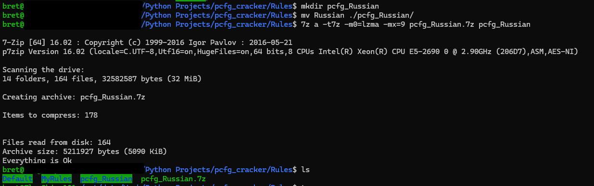
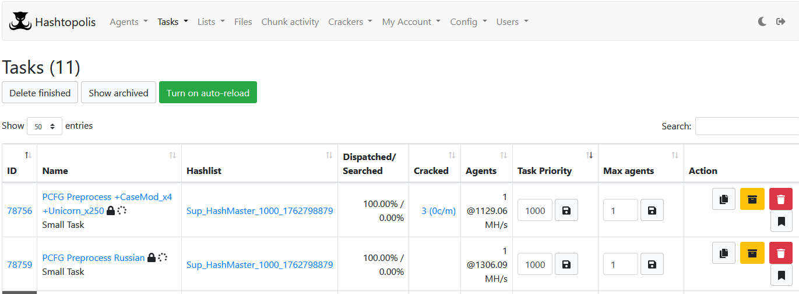

# PCFG Guesser (C-Compiled) — Hashtopolis-Compatible Build

This version of the **Programmatic Context-Free Grammar (PCFG) Guesser** has been compiled and modified for compatibility with **Hashtopolis**, the distributed password cracking management system. The goal is to allow PCFG to run as a continuous preprocessor (similar to `Prince`) and work seamlessly within Hashtopolis task structures.

This [project is a fork of the original compiled PCFG project](https://github.com/lakiw/compiled-pcfg). This project has only made modifications to the codebase in order to make it compatible with Hashtopolis. The core credit for this project should go to the original project creator.

---

## Key Features & Options
New features added that are different from the original project.

- `--keyspace`  
  Returns `1` and exits. This allows Hashtopolis to detect a valid keyspace value.

- `--skip`  
  A placeholder flag to prevent Hashtopolis from misinterpreting PCFG output. Without it, Hashtopolis might limit output to a single candidate.

- `--limited`  
  Another compatibility placeholder; has no functional effect.

- `-q`  
  Quiet mode — suppresses all non-candidate output, including error messages. This is important because Hashtopolis treats any non-password output as an error.

- `-R <rules_directory>`  
  Specifies the directory containing rule files. By default, `pcfg_guesser` looks for the `Rules` directory in its current working directory, which can be problematic if rules are stored elsewhere. The `-R` option allows specifying a custom path.

---

## Usage

- **Typical Run:** `./pcfg-guesser --skip --limited -R /path/to/Rules -r MyRules -q`

* **Keyspace Query:**  `./pcfg-guesser --keyspace -R /path/to/Rules -r MyRules -q`

---

# Hashtopolis Integration

The **PCFG Guesser preprocessor** functions similarly to the **Prince processor** in Hashtopolis. It runs indefinitely until manually stopped.

### Adding PCFG Guesser as a Hashtopolis Preprocessor

Use the following configuration to add PCFG Guesser as a preprocessor:

* **Name:** `pcfg_guesser`
* **Binary Basename:** `pcfg_guesser`
* **Download URL:** [https://github.com/Brets0150/compiled-pcfg/raw/refs/heads/master/pcfg_guesser.7z](https://github.com/Brets0150/compiled-pcfg/raw/refs/heads/master/pcfg_guesser.7z)
* **Commands:** `--keyspace`, `--skip`, `--limited`

> ⚠️ **Important:**
> The name and binary basename **must remain exactly the same (lowercase)**. Otherwise, Hashtopolis may fail to recognize the preprocessor.

**Note:** Currently, only a Linux 64-bit version has been compiled. Windows, ARM, or other architectures are not yet available.

---

## Distributing PCFG RuleSets via Hashtopolis

### How Hashtopolis Places Files on Agents

When a Hashtopolis agent downloads a file, it places it into the agent’s configured `files` directory (e.g., `/hashtopolis/files/`), relative to where you launch `python3 hashtopolis.zip`.
If you upload a `.7z` file, Hashtopolis will extract its contents into this same directory.

This means **you don’t need absolute paths** in the preprocessor command line. Simply reference the directory and filenames as uploaded.

Although the Hashtopolis documentation states that directories cannot be sent, in testing this method works reliably. The `-R` option in PCFG Guesser accommodates directory-based RuleSets.

---

### Packaging RuleSets for Hashtopolis

Below is the recommended method for packaging RuleSets. This example uses the original [PCFG Python project’s two RuleSets](https://github.com/lakiw/pcfg_cracker), but it applies to any custom set you create with the python trainer.

```bash
cd ./pcfg_cracker/Rules
mkdir pcfg_Russian
cp -r Russian ./pcfg_Russian/
7z a -t7z -m0=lzma -mx=9 pcfg_Russian.7z pcfg_Russian
```



**Once completed, upload the `.7z` file to Hashtopolis** — preferably under **Other Files**.

#### Quick One-Liner to Package Multiple RuleSets

```bash
cd ./pcfg_cracker/Rules
for d in $(ls); do mkdir "pcfg_${d}";cp -r "${d}" "pcfg_${d}";7z a -t7z -m0=lzma -mx=9 "pcfg_${d}.7z" "pcfg_${d}" ;done
```

---

## Creating a PCFG Guesser Task in Hashtopolis

1. Set the task as **Small** — ensures Hashtopolis assigns the full keyspace to a single agent.
2. Add **Hashcat rules** to increase candidate diversity and improve hash rate.
3. Select **pcfg_guesser** as the preprocessor.
4. Select the desired RuleSet file in the **Preprocessor Files** section.
5. Enter the following Preprocessor command-line options:

   ```
   -q -R <RuleSetDir> -r <RuleSetName>
   ```

   **Example:**

   ```
   -q -R pcfg_Russian -r Russian
   ```

In this example, the directory name (`pcfg_Russian`) matches the `.7z` file’s base name (without the extension).

When executed, Hashtopolis automatically prepends the agent’s `files` directory path. The resulting full command looks like:

```
-q -R /hashtopolis/files/pcfg_Russian -r Russian
```



---

## Handling Large RuleSets

For very large RuleSets (e.g., Gigabytes in size), PCFG may take several minutes before outputting candidates. This delay can trigger Hashcat’s default STDIN timeout (120s).

Increase the timeout using:

```
--stdin-timeout-abort=300
```

---

# Limiting Agents to PCFG Tasks

To restrict which agents can process PCFG preprocessor tasks:

1. Create a new **Access Group** (e.g., `PCFG Processors`).
2. Assign your user and selected agents to this group.
3. Assign the RuleSet files to the same access group.

Only agents within this group will receive PCFG-related tasks.

---

# Notes

* `--skip` and `--limited` are **placeholders only**. Even if given arguments (e.g., `--skip 100`), they perform **no action**.
* `-q` ensures only password candidates are printed, silencing all other output (including errors).

---
# Troubleshooting

If you experience issues with PCFG Guesser running under Hashtopolis, follow these steps to gather diagnostic information and understand what is being executed on the agent:

 1.   **Enable Hashtopolis agent debug mode**  
    Start the agent with `--debug` enabled (or enable debug in the agent configuration). This increases logging verbosity and records the exact commands Hashtopolis runs on the agent.
    
2.   **Review the agent logs**  
    Inspect the agent’s log files for the debug output. The logs will show the full preprocessor command line, environment, file paths, and any errors or exit codes produced by the preprocessor binary.
    
3.   **Verify the full command executed**  
    Use the debug logs to confirm that Hashtopolis is invoking the preprocessor with the expected arguments (including the `-R` path and `-r` RuleSet name). Pay attention to the absolute path Hashtopolis prepends (e.g., `/hashtopolis/files/...`).
    
4.   **Temporarily test without `-q` (if safe)**  
    If you can reproduce locally or in a controlled environment, run the preprocessor without `-q` to surface any startup messages or errors. Note: Hashtopolis treats non-candidate output as an error during normal processing, so only do this in a debug or local test environment.
    
5.   **Check file extraction & permissions**  
    Confirm that the uploaded `.7z` extracted correctly on the agent and that the RuleSet directory and files have appropriate read permissions for the agent process.
    
6.   **Reproduce manually (optional)**  
    If needed, run the same preprocessor command directly on an agent (or a similar environment) to observe its behavior interactively.
 
Following these steps will usually reveal whether the issue is caused by incorrect arguments, missing or mis-extracted RuleSet files, permission problems, or the preprocessor binary itself.

---

## Changelog

**2025-11-07**

* Added support for `--keyspace`, `--skip`, `--limited`, `-q`, and `-R`.
* Compiled and archived for Hashtopolis preprocessor integration.